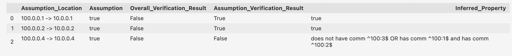

# Verification with Batfish
This directory contains some documentation and instructions for running the verification tool for networks that we are developing using Batfish. Additionally, there a few examples documenting the current state of the tool.

## Getting Started
1. Clone the verification branch of the repo... if you are reading this README, then you are looking at the correct branch. The url for the correct branch is linked [here](https://github.com/ana-brendel/batfish/tree/verification#).
2. Follow these instructions to download support for building with Bazel. _**TODO** get link_
3. You should create a virtual python environment. You will have to install any dependencies including `pybatfish`. The `pybatfish` instructions might be helpful if you get stuff; they're located [here](https://github.com/batfish/pybatfish/blob/master/README.md). To do this and install dependencies, run the following commands:
```
directory % cd .../batfish/verification
directory/batfish/verification % virtualenv -p python3 .
directory/batfish/verification % source ./bin/activate
directory/batfish/verification % pip install pandas 
directory/batfish/verification % pip install jinja2 
directory/batfish/verification % python3 -m pip install --upgrade pip
directory/batfish/verification % python3 -m pip install --upgrade pybatfish
```

## Running Batfish on Examples
_**To run Batfish, execute the following commands:**_
```
directory % cd .../batfish
directory/batfish % ./tools/bazel_run.sh
```
This command will not terminate, but it will start the Batfish process so that the `pybatfish` client can query. It should tell you `Build completed successfully` and then continue running the program in the page waiting for the `pybatfish` client to query.


_**To run the provided examples, look at the jupyter notebook in this directory titled (VerificationExamples.ipynb).**_

## Understanding the Results
Here is an example response from running the current `verify` `pybatfish` question:


_**What are the Assumption Location and Assumption Columns?**_

The locations in this column (each with their own row) correspond to the edges coming into the network from outside the network. Explicitly, they are edges where the destination is within the network and the source is not. The corresponding assumption is what our verification algorithm assumes is true at that location (the default is that any incoming edge's invariant is true - allowing all incoming traffic). The verification succeeds for that assumption if the inferred invariant is implied by the assumption. 

We automatically check all incoming edges (with default invariant of true); you can also provide assumptions which are not located at the incoming edges. The added invariants will be checked in additional to all incoming edges.

_**What is the Difference Between Overall and Assumption Verification Result?**_

The "Overall_Verification_Result" is true if all of the assumption verifications pass _and_ false is not inferred as any invariant. The "Assumption_Verification_Result" is true if that assumption implies the inferred invariant at that location.

_**What is the Inferred Invariant?**_

The final column is a readable representation of the invariant that was inferred at that location. **Please note** these invariants are only displayed if the `readable` flag is true. This is because the function which displays the invariants is exponential in the amount of distinct prefixes and communities (and other properties that get added) - so it can be slow. Additionally, it is somewhat hacky in how it works (more so included for exploration and development and not user usage). This column might get replaced with a counterexample column which will get a concrete route that serves to provide insight as to the source of the failure.